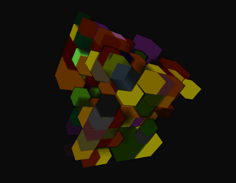

# Livre

Livre (Large-scale Interactive Volume Rendering Engine) is an out-of-core,
multi-node, multi-gpu, OpenGL volume rendering engine to visualise large
volumetric data sets. It can be retrieved by cloning the [source code]
(https://github.com/BlueBrain/Livre.git).

It provides the following major features to facilitate rendering of large volumetric data sets:
* Visualisation of pre-processed UVF format
  ([source code](https://github.com/SCIInstitute/Tuvok.git)) volume data sets.
* Real-time voxelisation of different data sources (surface meshes, BBP morphologies,
  local-field potentials, etc) through the use of plugins.
* Multi-node, multi-gpu rendering (Currently only sort-first rendering)

To keep track of the changes between releases check the [changelog](doc/Changelog.md).

Contact: bbp-open-source@googlegroups.com

## Known Bugs

Please file a [Bug Report](https://github.com/BlueBrain/Livre/issues) if you find new
issues which have not already been reported in
[Bug Report](https://github.com/BlueBrain/Livre/issues) page. If you find an already reported problem,
please update the corresponding issue with your inputs and outputs.

## About

The following platforms and build environments are tested:

* Linux: Ubuntu 14.04, RHEL 6.5 (Makefile, x64)

The [API documentation](http://bluebrain.github.io/Livre-0.5/index.html)
can be found on [bluebrain.github.io](http://bluebrain.github.io/).

## Building

Building from source is as simple as:

    git clone --recursive https://github.com/BlueBrain/Livre/
    mkdir Livre/Build
    cd Livre/Build
    cmake -GNinja -DCLONE_SUBPROJECTS=ON ..
    ninja

## Funding & Acknowledgment

The development of this software was supported by funding to the Blue Brain Project, a research center of the École polytechnique fédérale de
Lausanne (EPFL), from the Swiss government’s ETH Board of the Swiss Federal Institutes of Technology

Copyright (c) 2008-2021 Blue Brain Project/EPFL
